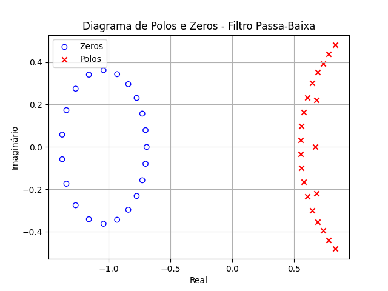
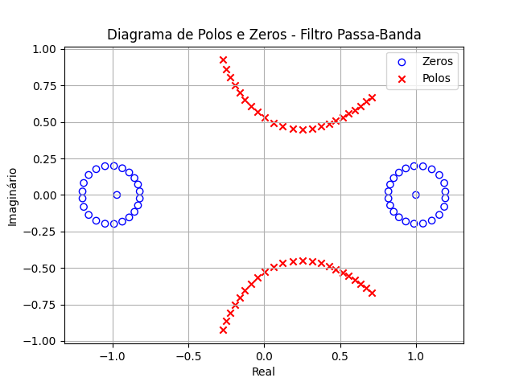
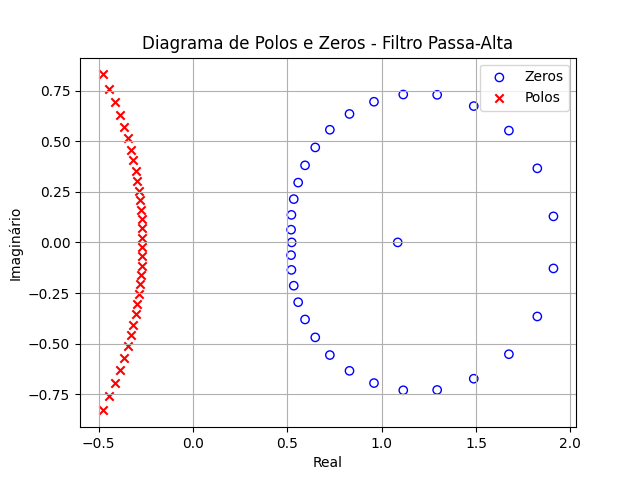
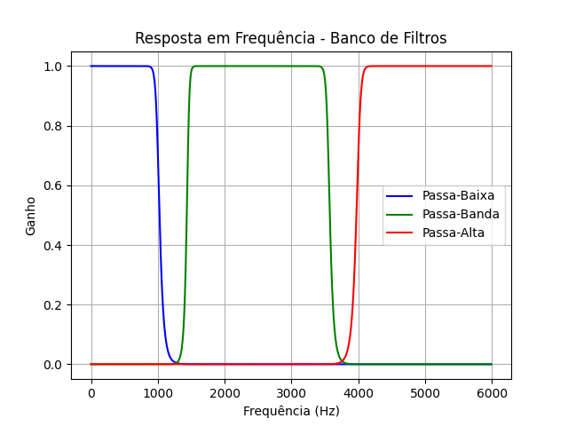
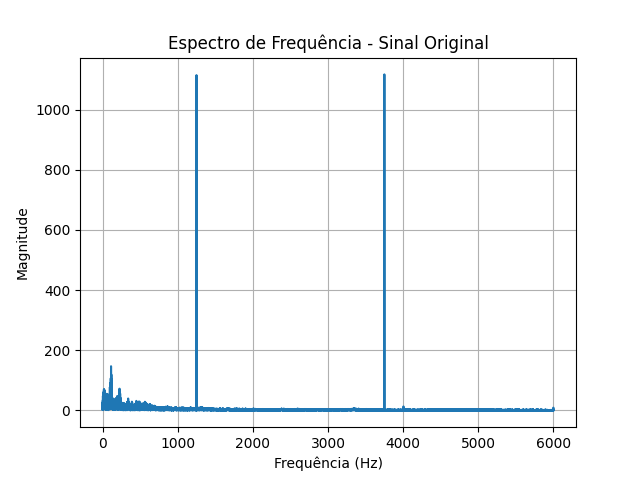
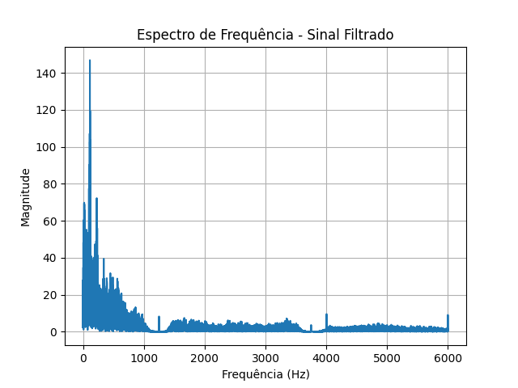

# Banco de Filtros (Passa-baixa, Passa-banda, Passa-alta)

1. Problema: um sinal digitalizado possui duas compenentes de interferências cossenoidais.

        z(t) = xi(t) + A[ cos(2pi x 1250 x t) + cos(2pi x 3750 x t)]
    - Frequência de amostragem: 12kHz
    
2. Projeto: um banco composto por filtros
    - 01 passa-baixa
    - 01 passa-banda
    - 01 passa-alta

    Em um banco de filtros, o sinal x[n] é filtrado por cada filtro e os resultados de filtragem são somados para compor o sinal filtrado final. As frequências de rejeição devem ser escolhidas tal que as interferências sejam suficientemente atenuadas.

3. Especificações

    - Frequências: cada filtro deve ter suas frequências de corte e atenuação especificadas tal que a banda de tgransição seja a menor possível.

    - Ordem: a ordem definirá o número de coeficientes do filtro

4. Resultados: os seguintes gráficos devem ser plotados

    - Diagrama de polos e zeros de cada filtro
    - Resposta em frequência do banco
    - Espectro de frequência do sinal antes e depois da filtragem

## Como executar o projeto

Para facilitar a execução do projeto com todas as suas dependências, foi utilizado o Virtual Environment (virtualenv) do Python 3. Todo o venv foi subido no repositório para facilitar a verificação do projeto. 

Para executá-lo no Linux ou Mac
```bash
./venv/bin/python3 main.py
```

Para executá-lo no Windows
```powershell
.\venv\Scripts\python3 main.py
```

## Resultados

### Audio

[audio filtrado](resultados/sinal_filtrado.wav)

### Polos e zeros de cada filtro





### Resposta em frequência do banco



### Espectros de frequência (original e filtrado)


